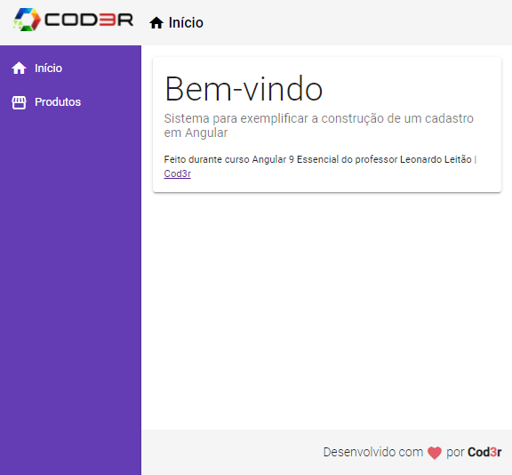

# CRUD em Angular

Projeto de CRUD desenvolvido durante curso Angular 9 Essencial da Cod3r

### Conteúdos abordados durante o curso:

- Componentes
- Módulos
- Diretivas
- Services
- Injeção de Dependências
- Pipes
- Navegação
- Observables
- Consumo de API Rest
- Material Design

